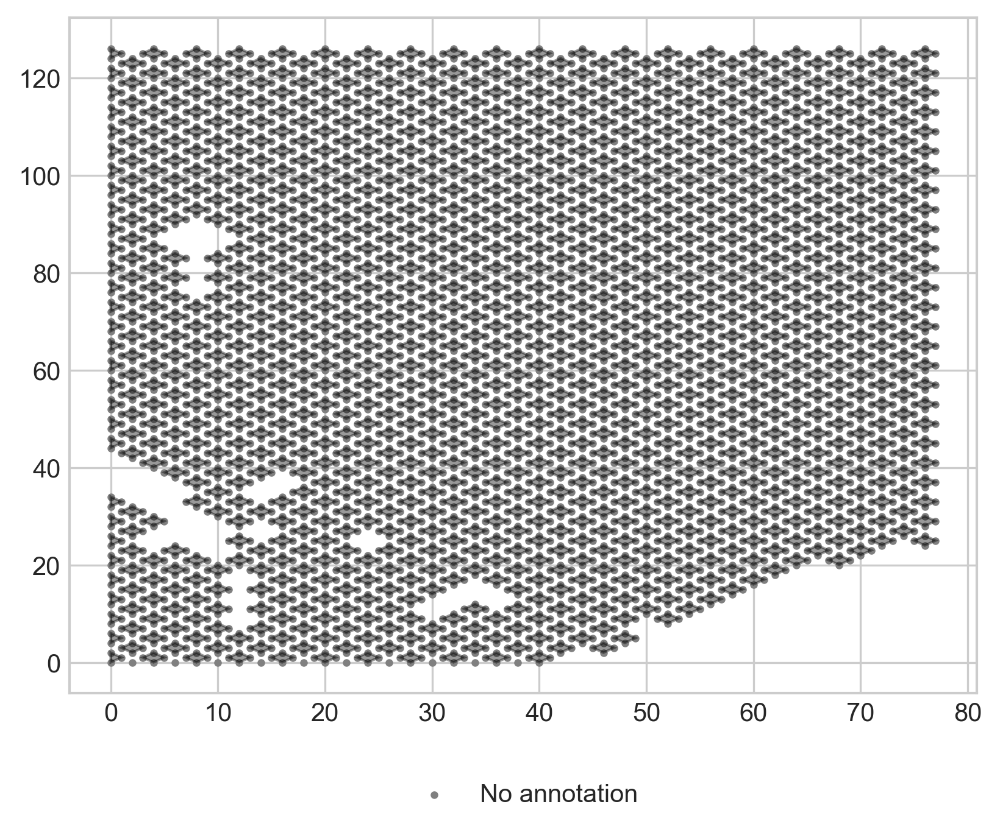
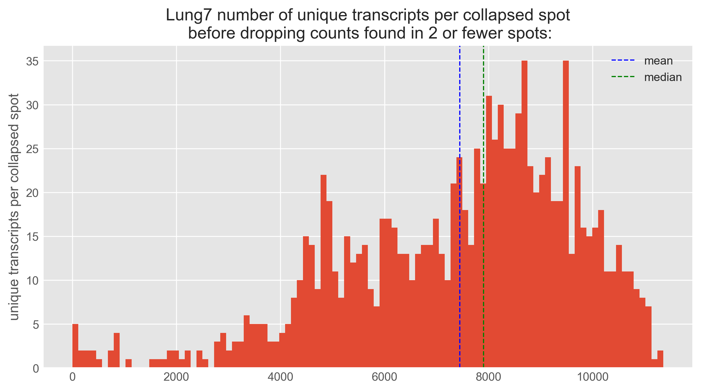
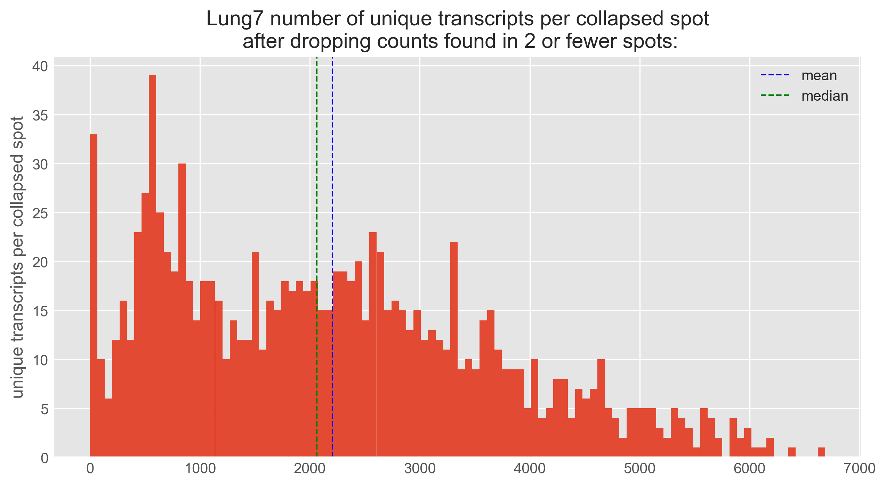

# Spatial Proteomics Simulation

This repository contains the code to simulate properties of spatial proteomics such as resolution and throughput in spatial transcriptomics datasets created using 10X Genomics' Visium.

The Visium data should be organized by tissue: the files for each tissue sample should live inside their own directory. A path to the directory containing all tissue directories should be provided to `1_process_raw_h5_files.py`. If pathologist annotations are also available (as is the case in the publication by [Arora et al. (2023)](https://doi.org/10.1038/s41467-023-40271-4)), the pipeline should begin with `0_process_annotations.R`. Otherwise each the pipeline should be run in consecutive order, beginning with `1_process_raw_h5_files.py`. This will create modified `.h5` expression files which simulate the characteristics of spatial proteomics. They can then be run through traditional transcriptomics pipelines to determind whether spatial proteomics is currently capable of achieving the same levels of biological success as spatial proteomics. 

### Simulating Different Resolutions
The script `2_simulate_resolution.py` creates versions of the gene expression matrix that collapse `n` spots together to simulate the larger voxel sizes common in spatial proteomics using laser capture microdissection. This script produces matrices collapsed by 3, 4, and 9 spots. In order to simulate the depth of spatial proteomics data found in recent publications [(Zhu et al., 2023)](https://doi.org/10.1074/mcp.TIR118.000686), the script drops expression counts found only in 2 or fewer of the collapsed spots. 

The following figure visualizes the Visium data collapsed by 4 spots. If pathologist annotations are provided, the dots will be colored by annotation.


The following two figures compare simulated proteome depth before and after dropping expression counts found in 2 or fewer spots.



## Prerequisites

- You should have Conda installed on your system. If you haven't installed Conda, you can download it from [https://docs.conda.io/en/latest/miniconda.html](https://docs.conda.io/en/latest/miniconda.html).

If you are working with a code repository, make sure to clone it to your local machine:

```bash
git clone https://github.com/zacheliason/spatial_proteomics_simulation.git
cd scp
```

## Environment Setup
1. Navigate to the directory containing the YAML file for the Conda environment (scp_envv.yml).
2. Open your command prompt or terminal and execute the following command to create and activate the Conda environment from the YAML file:
```bash
conda env create -f scp_env.yml
conda activate scp
```

## Running the Pipeline
Each script needs to be configured with the correct root directory. Then each can be run in consecutive order: 

```python
python3 1_process_raw_h5_files.py
python3 2_simulate_resolution.py
python3 3_simulate_sampling.py
python3 4_return_to_h5.py
```